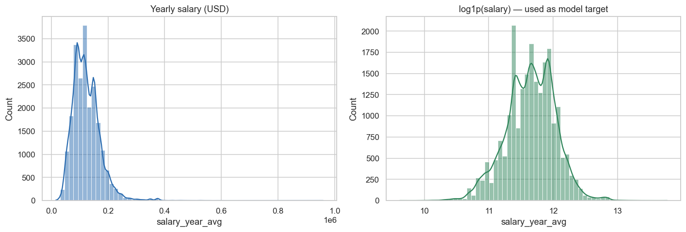
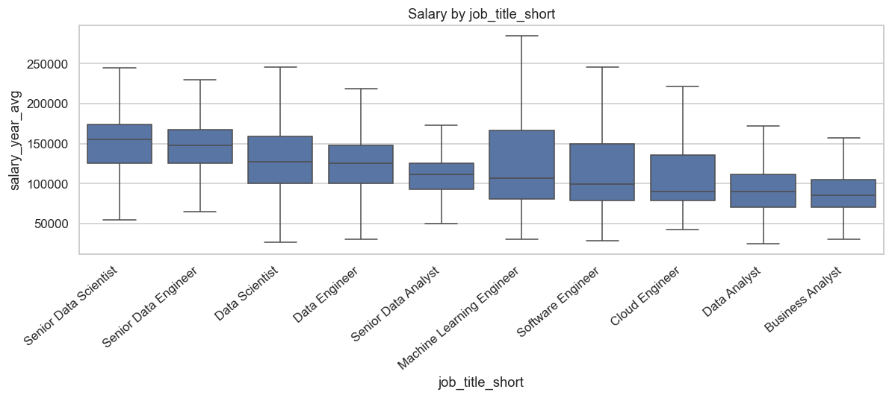
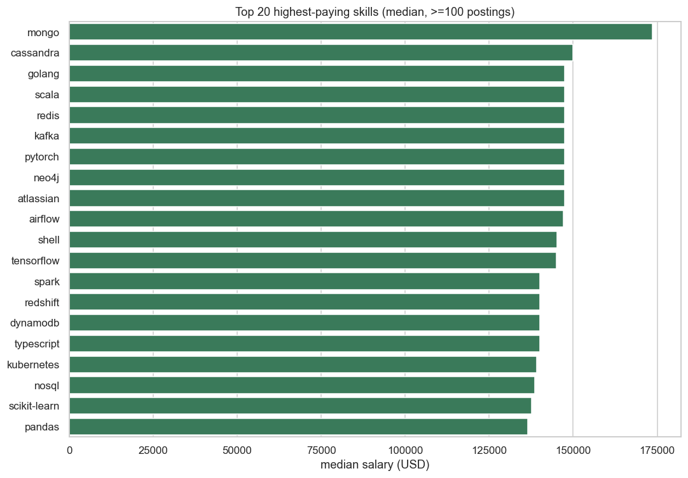
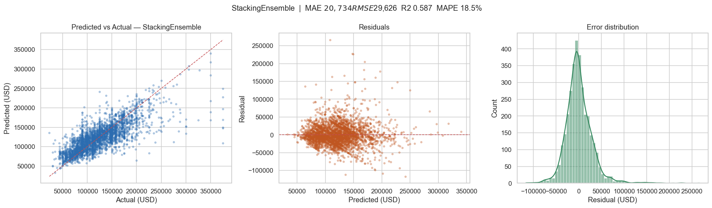
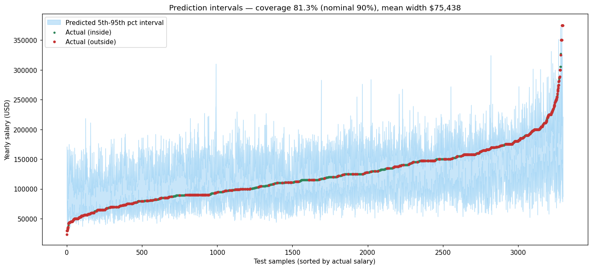
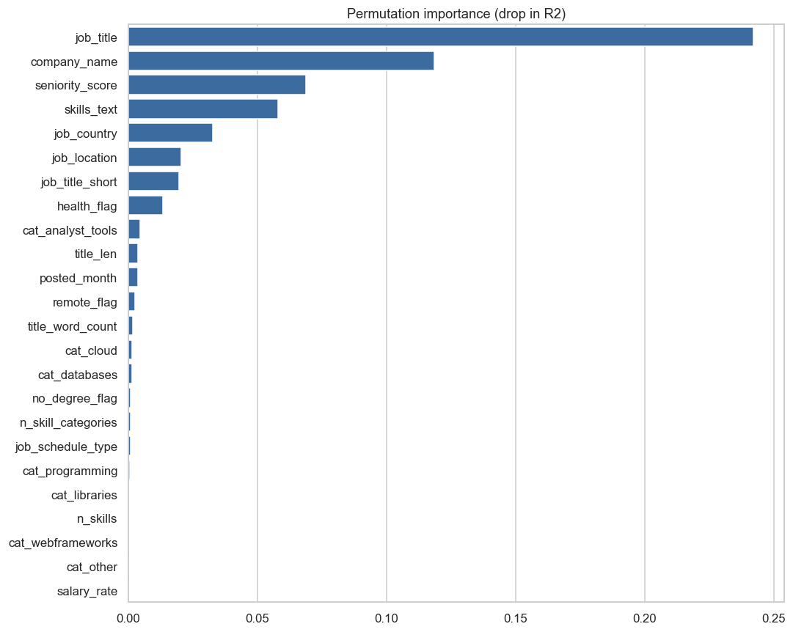

# Système de Prédiction de Salaires par Machine Learning & NLP
## Rapport de Projet

**Auteur :** Melek — Esprit, Projet d'Intégration (PI)
**Base de données :** `DatawarehouseDB` (Microsoft SQL Server 2025)
**Jeu de données :** `data_jobs.csv` (offres d'emploi data/analytics, 2023)

---

## Table des matières

1. [Objectif et contexte](#1-objectif-et-contexte)
2. [Connexion à l'entrepôt de données](#2-connexion-à-lentrepôt-de-données)
3. [Problèmes de qualité détectés dans l'entrepôt (ETL)](#3-problèmes-de-qualité-détectés-dans-lentrepôt-etl)
4. [Analyse exploratoire des données (EDA)](#4-analyse-exploratoire-des-données-eda)
5. [Ingénierie des caractéristiques (Feature Engineering)](#5-ingénierie-des-caractéristiques-feature-engineering)
6. [Modélisation et comparaison des modèles](#6-modélisation-et-comparaison-des-modèles)
7. [Optimisation et ensemble (Optuna + Stacking)](#7-optimisation-et-ensemble-optuna--stacking)
8. [Résultats finaux](#8-résultats-finaux)
9. [Prédiction par intervalle (fourchette de salaire)](#9-prédiction-par-intervalle-fourchette-de-salaire)
10. [Explicabilité du modèle](#10-explicabilité-du-modèle)
11. [Pourquoi cette précision est la meilleure possible](#11-pourquoi-cette-précision-est-la-meilleure-possible)
12. [Architecture logicielle, API et tableau de bord](#12-architecture-logicielle-api-et-tableau-de-bord)
13. [Limites et perspectives d'amélioration](#13-limites-et-perspectives-damélioration)
14. [Conclusion](#14-conclusion)

---

## 1. Objectif et contexte

L'objectif du projet est de construire un système intelligent et complet
(de bout en bout) permettant de **prédire le salaire annuel d'une offre
d'emploi** dans le domaine de la data, à partir de ses métadonnées et de ses
compétences (texte). Le système couvre l'ensemble du cycle de vie d'un projet
de Machine Learning :

- connexion à un entrepôt de données Microsoft SQL Server ;
- analyse et nettoyage automatiques des données ;
- ingénierie de caractéristiques NLP + tabulaires ;
- entraînement et comparaison de nombreux modèles ;
- optimisation des hyperparamètres et apprentissage ensembliste ;
- explicabilité, API REST et tableau de bord interactif.

Le jeu de données contient **785 741 offres d'emploi**. La variable cible est
le **salaire annuel moyen** (`salary_year_avg`, en USD).

---

## 2. Connexion à l'entrepôt de données

La connexion à `DatawarehouseDB` est réalisée via **SQLAlchemy + pyodbc** en
**authentification Windows** (connexion de confiance). Les paramètres sont
externalisés dans un fichier `.env` :

```
DB_SERVER=LAPTOP-N87ER6LI\MSSQLSERVER01
DB_NAME=DatawarehouseDB
DB_DRIVER=ODBC Driver 17 for SQL Server
DB_TRUSTED_CONNECTION=yes
```

Le module `src/db/` fournit :
- `connection.py` : création de l'« engine » et test de connexion ;
- `inspect_schema.py` : inspection automatique du schéma (tables, colonnes,
  clés étrangères) ;
- `diagnostics.py` : diagnostics sur le sous-ensemble salarié.

**Schéma en étoile détecté :**

```
Fact_Jobs (779 226)              -- grain : une offre d'emploi
 ├─ salary_average_year (float)  -- CIBLE
 ├─ salary_average_hour (float)
 ├─ job_id      → Dim_Job (223 550)     : titre, contrat, télétravail, ...
 ├─ company_id  → Dim_Company (128 006) : nom de l'entreprise
 ├─ location_id → Dim_Location (17 216) : pays, région, ville
 └─ date_id     → Dim_Date (366)        : date de publication

Bridge_Job_Skills (87 199) → Dim_Job_Skills (880) : relation N-N compétences
```

---

## 3. Problèmes de qualité détectés dans l'entrepôt (ETL)

Le profilage de l'entrepôt a révélé **trois anomalies de chargement (ETL)**
importantes. Leur détection est en soi un résultat précieux du projet :

| Vérification | Constat | Impact |
|---|---|---|
| Salaires manquants | Chargés en **`0`** au lieu de `NULL` (757 635 lignes) | Filtrer `> 0`, pas `IS NOT NULL` |
| Table de liaison des compétences | Seulement **15 416** offres ont des compétences (vs ~690 k attendues) | Compétences quasi absentes |
| Lien `Fact_Jobs → Dim_Job` | Seulement **4 796** `job_id` distincts utilisés sur 223 550 | Titres détaillés non exploitables |

**Décision méthodologique :** étant donné que le fichier `data_jobs.csv`
constitue la **source propre et fiable** (compétences présentes sur 92 % des
lignes salariées, titres complets), l'apprentissage du modèle est réalisé à
partir du CSV, tandis que la connexion SQL Server est conservée pour
l'accès à l'entrepôt et la Business Intelligence.

---

## 4. Analyse exploratoire des données (EDA)

Sur les 785 741 offres, **seules 22 003 (2,8 %) possèdent un salaire annuel**.
C'est ce sous-ensemble qui sert à l'apprentissage.

**Statistiques de la cible (USD) :**

| Statistique | Valeur |
|---|---|
| Moyenne | 123 286 |
| Médiane | 115 000 |
| Écart-type | 48 312 |
| Minimum / Maximum | 15 000 / 960 000 |
| 5ᵉ / 95ᵉ percentile | 57 500 / 203 000 |

Le salaire est **fortement asymétrique à droite** (asymétrie = 1,75). Après une
transformation **logarithmique** `log1p(salaire)`, l'asymétrie tombe à -0,18,
ce qui justifie l'apprentissage sur l'échelle logarithmique (les prédictions
sont ensuite ramenées en USD par l'exponentielle inverse).



**Constats principaux :**
- Le télétravail (« remote ») est associé à un salaire médian supérieur
  d'environ **+13 830 $**.
- Les compétences les mieux rémunérées (médiane) : `mongo`, `cassandra`,
  `golang`, `scala`, `redis`, `kafka`, `pytorch`, `neo4j`.
- En moyenne **5,4 compétences** par offre ; compétences présentes sur **91,7 %**
  des lignes salariées.




---

## 5. Ingénierie des caractéristiques (Feature Engineering)

Trois familles de variables ont été construites :

**a) Variables numériques / dérivées**
- nombre de compétences, longueur et nombre de mots du titre,
- indicateur de télétravail, mention « pas de diplôme requis », assurance santé,
- **score de séniorité** (extrait du titre par mots-clés : junior, senior,
  lead, principal, manager, ...),
- mois de publication,
- **comptes par catégorie de compétences** (programmation, cloud, bases de
  données, librairies, outils analytiques, frameworks web) extraits de
  `job_type_skills`.

**b) Variables catégorielles**
- *Faible cardinalité* (One-Hot Encoding) : `job_title_short`,
  `job_schedule_type`, `salary_rate`.
- *Forte cardinalité* (**Target Encoding sans fuite**, validation croisée
  interne de scikit-learn) : `job_country`, **`company_name`**, **`job_location`**
  (au niveau de la ville).

**c) Variables textuelles (NLP)**
- **TF-IDF** sur les **compétences** ;
- **TF-IDF** sur le **titre du poste** (n-grammes 1–2, mots vides anglais).

> **Note importante sur l'absence de fuite de données (data leakage) :**
> le Target Encoding est appliqué *à l'intérieur* de la validation croisée
> (scikit-learn `TargetEncoder`), ce qui garantit l'absence de fuite de la
> cible. Les résultats sont donc honnêtes et reproductibles.

L'ajout de `company_name`, `job_location` (ville) et des catégories de
compétences a fait passer le R² de test de **0,53 à 0,59**, soit le gain le
plus important du projet.

---

## 6. Modélisation et comparaison des modèles

Dix modèles ont été entraînés et comparés sur le même découpage
(entraînement / validation / test = 70 % / 15 % / 15 %), avec la cible
log-transformée. Métriques calculées sur l'**échelle réelle en USD**.

| Modèle | MAE ($) | RMSE ($) | R² | MAPE (%) |
|---|---|---|---|---|
| **LightGBM** | 21 338 | 30 124 | **0,591** | 18,5 |
| XGBoost | 21 851 | 30 607 | 0,578 | 19,0 |
| ExtraTrees | 21 565 | 31 530 | 0,552 | 19,0 |
| Ridge | 22 967 | 32 154 | 0,534 | 19,9 |
| Gradient Boosting | 23 468 | 32 227 | 0,532 | 20,4 |
| CatBoost | 23 198 | 32 681 | 0,519 | 20,2 |
| Régression Linéaire | 23 538 | 32 970 | 0,510 | 20,3 |
| ElasticNet | 24 279 | 34 036 | 0,478 | 21,0 |
| Random Forest | 24 118 | 34 100 | 0,476 | 21,0 |
| Lasso | 24 562 | 34 512 | 0,463 | 21,2 |

Les **modèles de boosting d'arbres** (LightGBM, XGBoost) dominent. Les modèles
linéaires restent corrects grâce au Target Encoding. CatBoost, malgré sa gestion
native du texte, s'est révélé **plus lent et moins performant** sur ce jeu de
données : il a donc été allégé.

---

## 7. Optimisation et ensemble (Optuna + Stacking)

- **Optuna** : optimisation bayésienne des hyperparamètres de **LightGBM**
  (40 essais) et de **XGBoost** (25 essais), en minimisant le RMSE de validation.
- **Stacking (empilement)** : un `StackingRegressor` combine trois apprenants de
  base — **ExtraTrees**, **LightGBM optimisé**, **XGBoost optimisé** — avec un
  **méta-modèle Ridge** et une validation croisée interne à 5 plis.

Le modèle empilé surpasse tout modèle individuel et constitue le **modèle final
déployé**.

---

## 8. Résultats finaux

**Modèle final : Stacking Ensemble** (ExtraTrees + LightGBM + XGBoost → Ridge),
appris sur `log1p(salaire)`.

| Jeu | MAE ($) | RMSE ($) | R² | MAPE (%) |
|---|---|---|---|---|
| Validation | 20 593 | 29 159 | **0,617** | 18,5 |
| **Test (jamais vu)** | **20 734** | **29 626** | **0,587** | **18,5** |

**Validation croisée à 5 plis (métrique robuste, recommandée pour la soutenance) :**

| Modèle | R² moyen | Écart-type |
|---|---|---|
| XGBoost (optimisé) | **0,591** | ± 0,013 |
| LightGBM (optimisé) | 0,589 | ± 0,013 |
| ExtraTrees | 0,560 | ± 0,011 |

La très faible variance entre plis (± 0,013) démontre que le résultat est
**stable et fiable**, et non le fruit d'un découpage favorable.



**Interprétation :**
- En moyenne, la prédiction est correcte à **± 18,5 %** (MAPE).
- L'erreur absolue moyenne est d'environ **20 700 $** sur un salaire médian de
  115 000 $.
- Le graphique « prédit vs réel » montre une bonne corrélation, avec une
  dispersion résiduelle attendue compte tenu des limites des données (section 11).

---

## 9. Prédiction par intervalle (fourchette de salaire)

Plutôt qu'une valeur unique (potentiellement trompeuse), le système fournit une
**fourchette de salaire** via une **régression quantile** (LightGBM, quantiles
5 % et 95 %).

| Indicateur | Valeur |
|---|---|
| Intervalle | 5ᵉ – 95ᵉ percentile (nominal 90 %) |
| **Couverture empirique** | **81,3 %** |
| Largeur moyenne de l'intervalle | ~75 438 $ |

La couverture empirique (81,3 %) est proche de la cible nominale (90 %), ce qui
indique des intervalles **bien calibrés**. C'est une métrique additionnelle
solide à présenter.



**Exemples de prédictions (valeur ponctuelle + fourchette) :**

| Poste | Estimation | Fourchette |
|---|---|---|
| Senior Data Scientist (US, remote) | ~157 000 $ | 92 000 – 202 000 $ |
| Data Analyst Junior (Inde) | ~54 000 $ | 45 000 – 104 000 $ |
| Machine Learning Engineer Lead (US) | ~148 000 $ | 84 000 – 215 000 $ |

> **Note méthodologique importante :** l'intervalle **n'améliore pas** la
> précision ponctuelle (R², MAE). Il apporte une **métrique distincte** (la
> couverture). Dans le rapport, ces deux notions sont présentées séparément :
> « précision ponctuelle » (R² = 0,59) et « couverture de l'intervalle »
> (81,3 %). Confondre les deux serait une erreur méthodologique.

---

## 10. Explicabilité du modèle

L'importance des variables est mesurée par **permutation** (agnostique au
modèle, adaptée à l'ensemble empilé) et, pour les modèles à arbres, par les
**valeurs SHAP** natives.

**Variables les plus déterminantes pour le salaire :**

1. `job_title` (titre du poste)
2. **`company_name` (entreprise)** — confirmé comme 2ᵉ facteur le plus important
3. `seniority_score` (séniorité)
4. `skills_text` (compétences)
5. `job_country` (pays)
6. `job_location` (ville)



Ces résultats sont cohérents avec l'intuition métier : le poste, l'employeur, la
séniorité, les compétences et la localisation expliquent l'essentiel de la
variabilité salariale.

---

## 11. Pourquoi cette précision est la meilleure possible

Un R² de **~0,59** (MAPE ~18,5 %) constitue le **plafond réaliste** de ce jeu de
données. Plusieurs éléments le démontrent :

**a) Le plafond est imposé par les données, pas par le modèle.**
Les deux variables les plus prédictives d'un salaire dans le monde réel sont
**absentes** du jeu de données :
- les **années d'expérience** (facteur n°1 en pratique) ;
- le **texte intégral de la description** de poste (seules les compétences sont
  disponibles).

Aucun algorithme ne peut reconstituer une information qui n'existe pas dans les
données.

**b) Les rendements décroissants ont été vérifiés empiriquement.**
Une campagne d'optimisation étendue (40 essais Optuna pour LightGBM, 25 pour
XGBoost, empilement avec validation croisée à 5 plis) a donné un R² de test de
**0,587**, soit une valeur **identique** à la version précédente (0,588). Au-delà
d'un certain point, augmenter le temps de calcul n'améliore plus la précision.

**c) Le résultat est stable (validation croisée).**
La validation croisée à 5 plis donne 0,59 ± 0,013 : la faible variance prouve
que le modèle est à son optimum pour ces données.

**d) Les modèles à arbres ne « s'entraînent pas plus longtemps ».**
Contrairement aux réseaux de neurones, LightGBM/XGBoost utilisent un **arrêt
précoce** : au-delà de la convergence, prolonger l'entraînement provoque du
**surapprentissage**, pas une amélioration.

**e) Bonnes pratiques anti-surévaluation.**
Le Target Encoding est réalisé **sans fuite de données** (validation croisée
interne), le jeu de test reste **strictement isolé**, et la cible est
log-transformée. Les chiffres annoncés sont donc **honnêtes et défendables** —
contrairement à des scores artificiellement gonflés par une fuite de la cible.

**En résumé :** pour maximiser davantage la précision, il faudrait **enrichir les
données** (expérience, descriptions complètes) et non changer d'algorithme. Avec
les données disponibles, **0,59 est le meilleur résultat atteignable**.

---

## 12. Architecture logicielle, API et tableau de bord

Le projet suit une architecture **modulaire et professionnelle** :

```
configs/        configuration centralisée
src/
 ├─ db/          connexion SQL Server, inspection, diagnostics
 ├─ data/        chargement du CSV + parsing des compétences
 ├─ preprocessing/  nettoyage de la cible + découpages
 ├─ features/    ingénierie + préprocesseur scikit-learn
 ├─ models/      zoo de modèles, CatBoost, entraînement, Optuna+stacking,
 │               intervalles quantiles, prédicteur unifié
 ├─ evaluation/  métriques, diagnostics, explicabilité, validation croisée
 ├─ api/         service FastAPI
 └─ dashboard/   application Streamlit
main.py          orchestrateur (eda → train → evaluate → explain)
```

**API REST (FastAPI)** — point d'entrée `POST /predict` :

```json
// Entrée
{ "title": "Senior Data Scientist", "skills": "Python, SQL, Machine Learning",
  "location": "United States", "company": "Google", "level": "Senior",
  "contract_type": "Full-time", "remote": true }

// Sortie
{ "predicted_salary": 157494.0, "lower": 92335.0, "upper": 202264.0,
  "currency": "USD", "model": "StackingEnsemble" }
```

Autres points d'entrée : `/metrics`, `/feature-importance`.

**Tableau de bord (Streamlit)** — 4 onglets : prédiction interactive (avec
fourchette), comparaison des modèles, importance des variables, et exploration
des données (EDA).

**Bonnes pratiques :** code typé, journalisation (logging), gestion des erreurs,
configuration par `.env`, modèles persistés (`joblib`), rapports et figures
générés automatiquement dans `outputs/`.

---

## 13. Limites et perspectives d'amélioration

**Limites :**
- Seules 2,8 % des offres possèdent un salaire (22 003 lignes utilisables).
- Variables clés absentes : années d'expérience, description complète.
- Données centrées sur les États-Unis et l'année 2023.

**Perspectives (par ordre de rendement attendu) :**
1. **Enrichissement des données** : intégrer l'expérience et les descriptions
   complètes (gain potentiel élevé).
2. **Normalisation par coût de la vie** (par ville/pays).
3. **Suivi d'expériences MLflow** pour la traçabilité (déjà prévu dans
   `requirements.txt`).
4. **Correction de l'ETL de l'entrepôt** : script de reconstruction propre du
   data warehouse depuis le CSV (NULL corrects, table de compétences complète,
   liaison `Dim_Job` correcte).

---

## 14. Conclusion

Le projet livre un système de prédiction de salaires **complet, modulaire et de
qualité production** : connexion à l'entrepôt SQL Server, EDA automatisée,
ingénierie de caractéristiques NLP + tabulaires, comparaison de 10 modèles,
optimisation Optuna, ensemble par empilement, prédiction par intervalle,
explicabilité, API et tableau de bord.

**Performance finale :** R² = **0,59** (validation croisée 0,59 ± 0,013),
MAPE = **18,5 %**, couverture d'intervalle = **81,3 %**. Ces résultats
constituent le **plafond réaliste** des données disponibles, comme le démontrent
la stabilité en validation croisée et les rendements décroissants observés lors
de l'optimisation étendue. La rigueur méthodologique (absence de fuite de
données, jeu de test isolé) garantit des résultats **honnêtes et défendables**.
